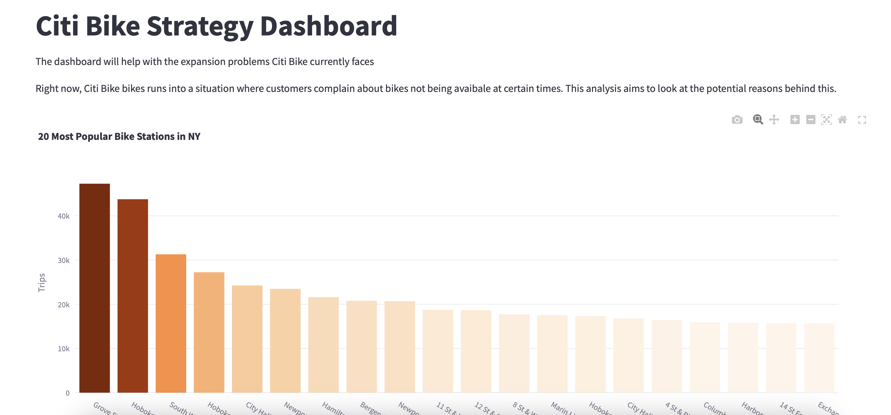

# My CF Project
A demo for dashboard development.

## Prerequisites

- **Python version:** 3.10
- **Git** installed on your machine

## How It Works

1. **Clone this repository**
   ```bash
   git clone https://github.com/hovhannisyan91/demorepocf.git
   ```

2. **Navigate to the project folder**
   ```bash
   cd demorepocf
   ```

3. **Open with a code editor** (e.g., VS Code, PyCharm)

4. **Create a virtual environment**
   - Using **conda**:
     ```bash
     conda create -n venv python=3.10
     ```
   - Using **venv** (built-in):
     ```bash
     python -m venv venv
     ```

5. **Activate the virtual environment**
   - With **conda**:
     ```bash
     conda activate venv
     ```
   - With **venv**:
     - **Linux/macOS:**
       ```bash
       source venv/bin/activate
       ```
     - **Windows:**
       ```bash
       .\venv\Scripts\activate
       ```

6. **Install the requirements**
   ```bash
   pip install -r requirements.txt
   ```
   > 💡 If `requirements.txt` is missing, generate one with:
   > ```bash
   > pip freeze > requirements.txt
   > ```

7. **Run the application**
   ```bash
   streamlit run run.py
   ```
   > If you have multiple entry points (e.g., a multi-page app), adjust accordingly:
   > ```bash
   > streamlit run pages/Home_Page.py
   > ```

8. **Result**
   

---

## Optional: Environment Variables

If your project requires database connections or API keys:

1. Copy the example file:
   ```bash
   cp .env.example .env
   ```
2. Fill in the required values in `.env`.

Make sure your code loads environment variables (e.g., using `python-dotenv`).

---

## Troubleshooting

- **Virtual environment not activating**  
  Check that you are using the correct shell (PowerShell, bash, zsh).

- **`streamlit: command not found`**  
  Install inside the environment:
  ```bash
  pip install streamlit
  ```

- **Port already in use**  
  Run Streamlit on a different port:
  ```bash
  streamlit run run.py --server.port 8502
  ```

---

## License

This project is for demo and educational purposes.
